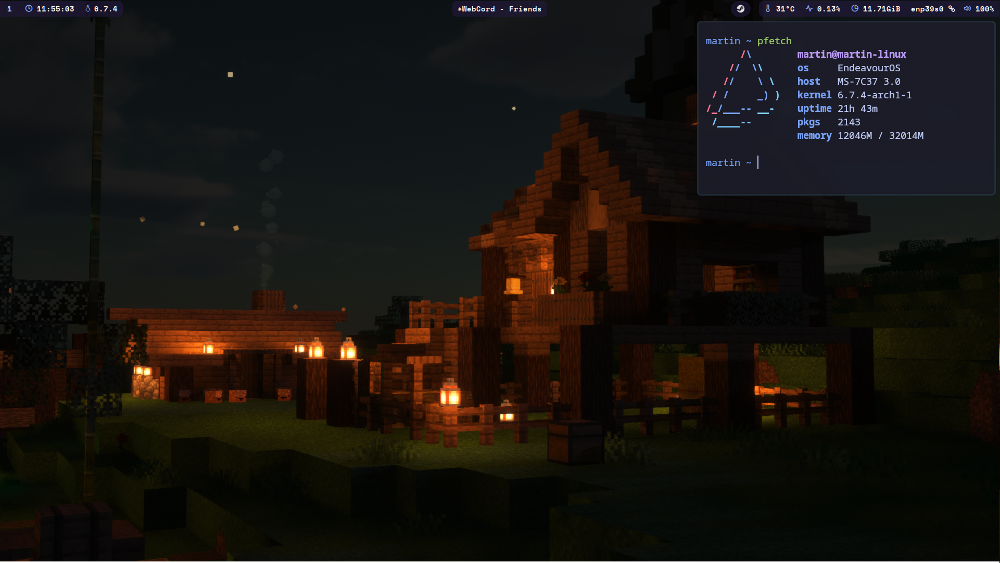

<h1 align="center">.dotfiles</h1>
<h4 align="center">by zibiax</h4>
<h4 align="center">based on the tokyonight color scheme.</h4>



- **Operating System:** [EndeavourOS](https://endeavouros.com/)
- **Compositor:** [Hyprland](https://github.com/hyprwm/Hyprland)
- **Terminal Emulator:** [Kitty](https://github.com/kovidgoyal/kitty)
- **Status Bar:** [waybar](https://github.com/Alexays/Waybar/)
- **App Launcher:** [rofi](https://github.com/lbonn/rofi)
- **Notification Daemon:** [dunst](https://github.com/dunst-project/dunst)
- **Shell:** [zsh](https://www.zsh.org/)
- **Shell Plugin Manager:** [zgenom](https://github.com/jandamm/zgenom)
- **Browser:** [Firefox](https://www.mozilla.org/en-GB/firefox/new/)

## ✔️ Installation

```
$ git clone https://github.com/zibiax/dotfiles.git && cd dotfiles && ./install
```

This will create symlinks and overwrite files. It will also install all packages from needed.list. Please backup your current configs before installing!

You will then have to enter files containing configs specific to my setup and edit them. eg. dual monitor configs

## 🖥️ Wallpapers

[Wallpaper Folder](https://github.com/zibiax/dotfiles/tree/main/Wallpapers)
